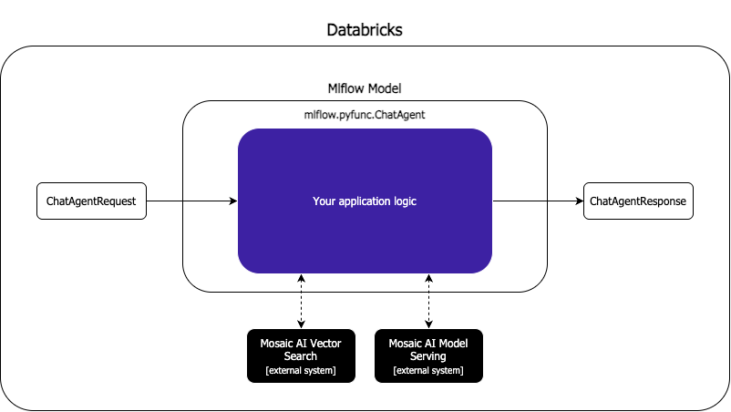
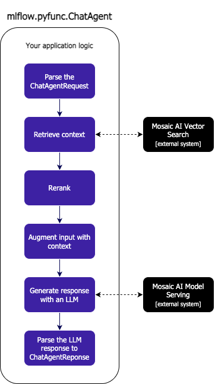

# Conversational RAG Chatbot

In this module, we will implement a conversational RAG chatbot. At the end, you will be able to use this in the Databricks Playground.

https://github.com/user-attachments/assets/45087950-a6f7-4344-850e-554bd37096c5

## Why 'Conversational' Matters in Generative AI Applications

For AI assistants to provide natural, human-like interactions, they must understand the context of ongoing conversations. Unlike humans who naturally remember previous exchanges, AI systems need to be explicitly provided with conversation history. In our conversational applications, we pass the complete chat history to the model provider API with each interaction, allowing the Large Language Model to comprehend previous context and respond appropriately to follow-up questions. 

Without this history, the AI would process each message in isolation, creating a fragmented experience where users must repeatedly provide context. By ensuring the frontend tracks and transmits conversation history, we enable seamless dialogues where the AI maintains continuity across multiple exchanges.

In our case, we assume the frontend keeps track of the conversation history and always sends us a list of messages:

```JSON
{
    "messages": [
      {
          "role": "system",
          "content": "You are an assistant tasked with answering the user's questions related to Databricks."
      },
      {
          "role": "user",
          "content": "What is the medallion architecture?"
      }
  ]
}
```

## The Architecture of a Conversational RAG Chatbot on Databricks

Now that we understand what we will receive from the frontend, we need to design the architecture. This section will cover how we go from a list of chat messages to a response.

### High-Level Architecture

MLflow has introduced a special 'flavor' for this, namely the [`mlflow.pyfunc.ChatAgent`](https://mlflow.org/docs/latest/api_reference/python_api/mlflow.pyfunc.html#mlflow.pyfunc.ChatAgent). This interface validates the requests from the frontend, ensuring it contains a list of messages. While there is also an [`mlflow.pyfunc.ChatModel`](https://mlflow.org/docs/latest/api_reference/python_api/mlflow.pyfunc.html#mlflow.pyfunc.ChatModel) type, Databricks recommends using the [`ChatAgent`](https://mlflow.org/docs/latest/api_reference/python_api/mlflow.pyfunc.html#mlflow.pyfunc.ChatAgent). The key distinction is that the [`ChatModel`](https://mlflow.org/docs/latest/api_reference/python_api/mlflow.pyfunc.html#mlflow.pyfunc.ChatModel) can only return a single message, whereas [`ChatAgent`](https://mlflow.org/docs/latest/api_reference/python_api/mlflow.pyfunc.html#mlflow.pyfunc.ChatAgent) can return multiple messages. This is important because if you decide to update your chatbot to, for example, also return tool calls, this is only possible with the [`ChatAgent`](https://mlflow.org/docs/latest/api_reference/python_api/mlflow.pyfunc.html#mlflow.pyfunc.ChatAgent). We will see an example of this in the [next module](/modules/1-conversational-rag/1a-conversational-rag-custom-responses/).

On a high-level, our application will receive a [`ChatAgentRequest`](https://mlflow.org/docs/latest/api_reference/python_api/mlflow.types.html#mlflow.types.agent.ChatAgentRequest) from the frontend, which contains the list of messages. Our application logic will then process this list of messages and use Mosaic AI [Vector Search](https://docs.databricks.com/aws/en/generative-ai/vector-search) and [Model Serving](https://docs.databricks.com/aws/en/machine-learning/model-serving/) to generate an answer, which is returned as a [`ChatAgentResponse`](https://mlflow.org/docs/latest/api_reference/python_api/mlflow.types.html#mlflow.types.agent.ChatAgentResponse).

<p align="center">
  
</p>

### Detailed Architecture

Let's zoom into the application logic. When we receive the [`ChatAgentRequest`](https://mlflow.org/docs/latest/api_reference/python_api/mlflow.types.html#mlflow.types.agent.ChatAgentRequest) with the messages, we need to complete several steps to reply with a [`ChatAgentResponse`](https://mlflow.org/docs/latest/api_reference/python_api/mlflow.types.html#mlflow.types.agent.ChatAgentResponse):

1. **Parse the [`ChatAgentRequest`](https://mlflow.org/docs/latest/api_reference/python_api/mlflow.types.html#mlflow.types.agent.ChatAgentRequest):** This object contains a list of [`ChatMessages`](https://mlflow.org/docs/latest/api_reference/python_api/mlflow.types.html#mlflow.types.agent.ChatAgentMessage). We first convert this to a list of dictionaries, then extract the latest message to use in the vector search for retrieving context.

2. **Retrieve context:** We take the last chat message and embed it. This embedding is then used to find 'context' or documents that are most similar using Mosaic AI Vector Search.

3. **Rerank:** We take the retrieved documents (say 25) and rerank them, keeping only the most relevant ones (e.g., the top 5).

4. **Augment input with context:** We combine the retrieved documents with the question in the latest message, and overwrite the latest message with this new augmented version.

5. **Generate response with an LLM:** We send the full chat history to an LLM provider. In this case, we use LLama 3.1 hosted on Mosaic AI Model Serving.

6. **Parse the LLM response:** Once we receive the response from the LLM provider, we parse it into the [`ChatAgentResponse`](https://mlflow.org/docs/latest/api_reference/python_api/mlflow.types.html#mlflow.types.agent.ChatAgentResponse) object to meet the response format of the [`ChatAgent`](https://mlflow.org/docs/latest/api_reference/python_api/mlflow.pyfunc.html#mlflow.pyfunc.ChatAgent) type, which returned to the frontend.

<p align="center">
  
</p>

## Design Considerations

You might ask, why not use [`mlflow.langchain`](https://mlflow.org/docs/latest/api_reference/python_api/mlflow.langchain.html) or [`mlflow.llama_index`](https://mlflow.org/docs/latest/api_reference/python_api/mlflow.llama_index.html)? These frameworks have their own input and output expectations, which don't necessarily integrate easily with conversational chat applications. For example, with Langchain, the input format for a conversational chat application would look like this:

```JSON
{
    "input": "What is the medallion architecture?",
    "chat_history": {
        "messages": [
            {
                "role": "assistant",
                "content": "The Medallion Architecture is a data design pattern used to logically organize data in a lakehouse. It is a procedural framework that provides a structured way to progressively refine datasets by using a series of isolated data layers. The architecture is typically composed of three tiers...",
                "id": "chatcmpl_ebb6ba82-170e-42bb-8cde-456f6d34cc9f"
            }
        ]
    }
}
```

We opted for a pure Python implementation, using the Databricks SDK for vector search, the sentence transformer package for embedding and reranking, and a Databricks-adapted version of the OpenAI SDK for LLM API calls. Integrating these packages in pure Python is straightforward and highly customizable.

There are scenarios where you might benefit from using frameworks, particularly when your application logic moves toward an [agentic architecture](https://www.anthropic.com/engineering/building-effective-agents). Frameworks like [LangGraph](https://langchain-ai.github.io/langgraph/tutorials/introduction/), [PydanticAI](https://ai.pydantic.dev/), or [CrewAI](https://docs.crewai.com/introduction) can be helpful in these cases. You can either use the framework-specific MLflow flavor or implement it within the [`ChatAgent`](https://mlflow.org/docs/latest/api_reference/python_api/mlflow.pyfunc.html#mlflow.pyfunc.ChatAgent) or [`PythonModel`](https://mlflow.org/docs/latest/api_reference/python_api/mlflow.pyfunc.html#mlflow.pyfunc.PythonModel) to deploy it to a serving endpoint

## Dive into the code

Now that you are up to speed of what we are going to buidl, you can find the full implementation [here](ConversationalRAG.py). If you want to register the model in MLflow, consult this [notebook](ConversationalRAG.ipynb). It goes through the steps of registering the model in Unity Catalog and deploying it to a Model Serving Endpoint so that you can use it in the Databricks Playground.
