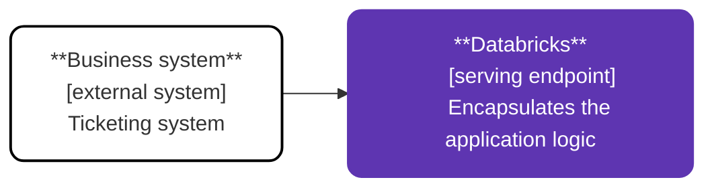
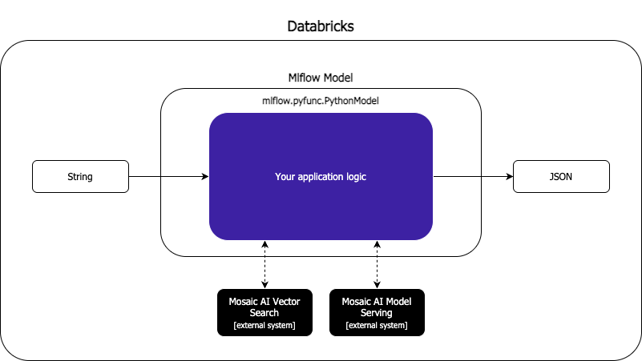
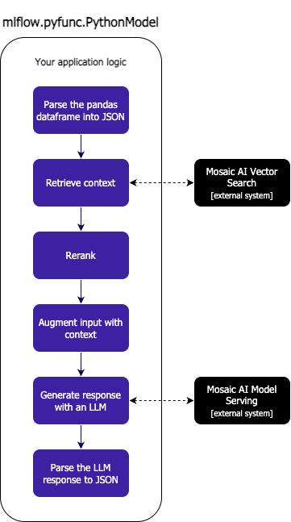

# Automating Business Processes

In this module, we will create a simple serving endpoint that processes support tickets or emails. By the end, you'll have a working endpoint that can receive text data and return structured information ready for your business workflows.

## Why Business Process Automation Matters in Generative AI Applications

Generative AI can significantly streamline business workflows by automating the processing of unstructured data. Unlike conversational applications where human interaction is central, business process automation focuses on system-to-system interactions where external systems submit data to a serving endpoint and receive processed or transformed data in response.

This pattern is particularly valuable for:

- Processing support tickets and categorizing them by priority, department, and required action
- Extracting structured information from emails or documents
- Transforming unstructured data into structured formats for downstream systems
- Automating routine decision-making processes based on textual inputs

While we showcase this as an external integration, this pattern can also be implemented as a Databricks workflow or pipeline, allowing you to process data at scale without human intervention.

## The Architecture of Business Process Automation on Databricks

This section covers how we transform unstructured text into structured data that can be used in business workflows.

### High-Level Architecture

Unlike our conversational RAG implementation, we won't be using the [`ChatAgent`](https://mlflow.org/docs/latest/api_reference/python_api/mlflow.types.html#mlflow.types.agent.ChatAgentResponse) interface. Instead, we'll use the [`PythonModel`](https://mlflow.org/docs/latest/api_reference/python_api/mlflow.pyfunc.html) flavor, which gives us more flexibility in defining custom input and output structures. This approach allows us to receive arbitrary JSON data and return structured information that can be easily integrated with downstream business systems.

  

One important consideration when working with the [`PythonModel`](https://mlflow.org/docs/latest/api_reference/python_api/mlflow.pyfunc.html) interface is that even if you send a JSON object to the serving endpoints that use [`predict`](https://mlflow.org/docs/latest/api_reference/python_api/mlflow.pyfunc.html#function-based-model), it will always convert it to a pandas dataframe. This means your code needs to handle this conversion and transform the dataframe back to the desired structure.

### Detailed Architecture

When our endpoint receives a request, it follows these steps to process the data:

1. **Parse the input:** Convert the pandas dataframe back to a dictionary structure that we can work with.

2. **Retrieve context:** Similar to our RAG implementation, we embed the input text and use Vector Search to find relevant context that will help the LLM understand domain-specific terminology and processes.

3. **Rerank:** We rerank the retrieved documents to ensure we're using only the most relevant context.

4. **Generate structured output with an LLM:** We send the input text along with the retrieved context to an LLM, but with a key difference from our conversational implementation - we specify a structured output format using [JSON mode or function calling](https://platform.openai.com/docs/guides/structured-outputs?api-mode=responses). This forces the model to return its answer in a structured format that can be programmatically processed.

5. **Return structured data:** The structured output from the LLM is returned to the calling system, ready to be integrated into business workflows.

  

## Design Considerations

When implementing business process automation with generative AI, consider these key factors:

- **Single-turn vs. multi-turn interactions:** Unlike conversational applications, business process automation typically involves single-turn interactions, eliminating the need to maintain conversation history.

- **Structured outputs:** Defining a clear schema for the expected output ensures consistency and reliability in downstream processes. This is crucial for business automation where the outputs may trigger other automated actions.

## Dive into the Code

Now that you understand the architecture and design considerations, you can find the full implementation [here](BusinessProcessAutomation.py). If you want to register the model in MLflow, consult this [notebook](BusinessProcessAutomation.ipynb). It guides you through the steps of registering the model in Unity Catalog and deploying it to a Model Serving Endpoint so that it can be integrated with your business systems.
