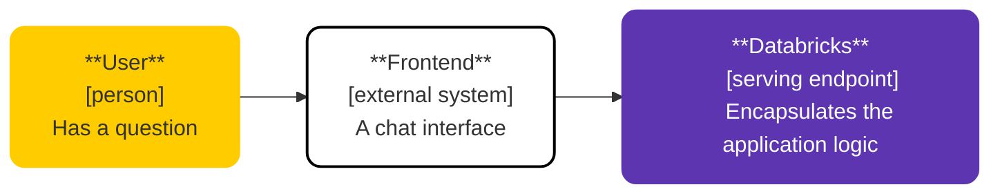
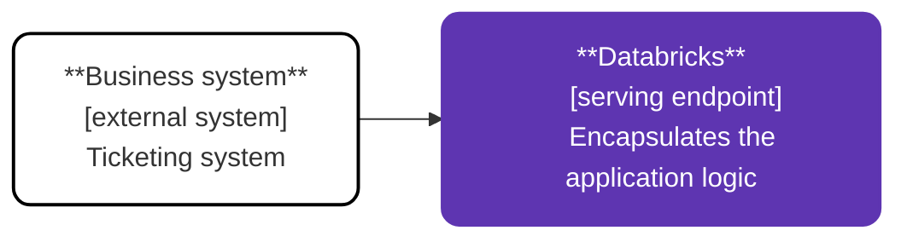

# Retrieval Augmented Generation (RAG)

Among the many Generative AI architectures, **Retrieval Augmented Generation (RAG)** is an ideal starting point for enterprises. It has low implementation complexity and addresses one of the most fundamental limitations of LLMs: their inability to access up-to-date or organization-specific information.

RAG consists of three key steps:

1. **Retrieval:** Use the user's question to search for relevant documents.
2. **Augmentation:** Append the retrieved documents to the user's question.
3. **Generation:** Send the augmented question to an LLM to generate an answer.

## Overview of the Architectures

For our demonstrations, we use *Delta Lake: The Definitive Guide* as our knowledge base, enabling our chatbot to answer questions about Delta Lake. As you can see in the video below, the Llama 3.3 model does not really know what a Delta Lake is; at least not in our conext. RAG addresses this by incorporating domain knowledge from the book into the model.

https://github.com/user-attachments/assets/267c1e99-93b6-43f7-85af-62ce6784f247

Before implementing any RAG chatbot, we must first create a Vector Index in which we store the book. The setup scripts for creating the Vector Index in Databricks can be found in [`modules/0-creating-the-vector-store`](modules/0-creating-the-vector-store/README.md).

> All these architectures require GPU-equipped model serving endpoints. The CPU instances only have 4GB of memory, and we need more because we load the embeddings model into memory.

### [1. Conversational RAG Chatbot](/architectures/retrieval-augmented-generation/1-conversational-rag/)

This implementation resembles ChatGPT with search capabilities, but instead of searching the internet, we query our vector index to answer questions related to *Delta Lake: The Definitive Guide*. The application accepts user questions as input and returns an single answer based on the retrieved context.

### [2. Conversational RAG Chatbot with toolcall feedback](/architectures/retrieval-augmented-generation/2-conversational-rag-custom-responses/)

This implementation is almost the same as the first one; however, in the UI it will show the user the steps it is taking, for example 'retrieving documents', and returns the documents it retrieved to the user before generating the answer. This allows you to reproduce the modern ChatGPT interfaces where intermediate steps like *"searching the internet..."* or "*thinking..."* are shown to the user.

### [3. Automating a business process](/architectures/retrieval-augmented-generation/3-business-process-automation/)

This verion demonstrates how generative AI can automate workflows without human interaction. An external system submits data to the serving endpoint and receives processed or transformed data in response. While we showcase an external integration, this pattern can also be implemented as a workflow or pipeline within Databricks.

